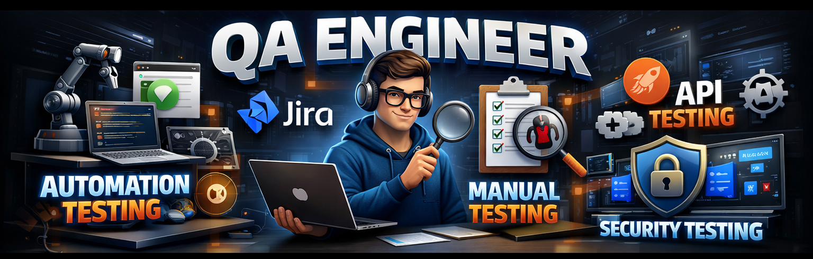

<h1 align="center"></h1>

  

## 👨🏻‍💻 About Me

✨ **QA Automation Engineer | Software Tester**

🔍 Passionate about ensuring software quality through effective Manual and Automation and Security Testing practices.

💼 Experienced in **Selenium with Python, API Testing, Postman, Test Case Design, Bug Reporting, Regression Testing, Smoke Testing, and SDLC/STLC methodologies.**

🚀 Currently enhancing my expertise in **Selenium, Playwright, API Automation, and Test Framework Development.**

💬 Ask me about **Software Testing, Automation Testing, API Testing, Selenium, Python, and QA Best Practices.**

🎯 Actively seeking opportunities as a **QA Automation Engineer** where I can contribute to building reliable and high-quality software products.

📫 Reach me at: **[webravi11@gmail.com](mailto:webravi11@gmail.com)**
🔗 LinkedIn: **linkedin.com/in/raviranjan0**

⚡ Beyond testing, I enjoy building a stronger **Physique 🏋️** and a sharper **Mind 🧠** — continuously improving both personally and professionally.

<h3 align="left">Connect with me :</h3>

  
 
  
  
  

</tr>
</table>

<h1> Tools & Technology </h1>

<!-- 🧪 Testing Section -->
<h2 align="center">🧪 QA Automation & Testing Skills</h2> <table align="center"> <tr> <td align="center" width="90">   Selenium </td> <td align="center" width="90">   Python </td> <td align="center" width="90">   Playwright </td> <td align="center" width="90">   Cypress </td> <td align="center" width="90">   Postman </td> <td align="center" width="90">   SQL </td> <td align="center" width="90">   Jira </td> <td align="center" width="90">   Jenkins </td> </tr> <tr> <td align="center" width="90">   GitHub </td> <td align="center" width="90">   Git </td> <td align="center" width="90">   PyTest </td> <td align="center" width="90">   API Testing </td> <td align="center" width="90">   Manual Testing </td> <td align="center" width="90">   Bug Tracking </td> <td align="center" width="90">   Test Cases </td> <td align="center" width="90">   Agile </td> </tr> </table>

## 📊 GitHub Stats & Trophies

  

  

  

<picture>
  <source media="(prefers-color-scheme: dark)" srcset="https://raw.githubusercontent.com/abozanona/abozanona/output/pacman-contribution-graph-dark.svg">
  <source media="(prefers-color-scheme: light)" srcset="https://raw.githubusercontent.com/abozanona/abozanona/output/pacman-contribution-graph.svg">
  
</picture>

  

